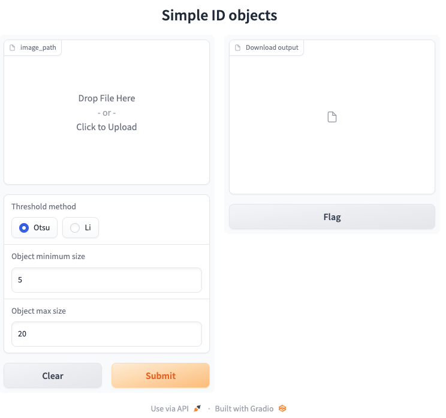

# Using Docker and Gradio to create a simple and reproducible web-based GUI

### What is Docker?

In essence, docker runs a "container" on your computer that is isolated from the rest of your system. As a result, the docker container possesses all the dependencies it requires. This container can then be "deployed" across multiple systems, such as a collaborator's computer, with minimal installation required (only installing docker is required). 

The benefit here is that you do not have to worry about installation issues when, for example, installing python dependencies. All a user must do is download docker, download a docker container/image and run. 

### What is gradio?

Gradio is a python package that makes it each to create web-based interfaces. If you have a function that processes a file in some way, you can create interactive inputs that are passed to that function. The return of that function is also shown in the web app. For example, the function may return a processed image.

Gradio is created by HuggingFace [who host a lot of cool AI demos](https://huggingface.co/spaces), such as [stable diffusion](https://huggingface.co/spaces/stabilityai/stable-diffusion). For all of these gradio apps on HuggingFace (termed "spaces"), you can see the code behind the app by clicking on `Files` in the top right.

### Docker + Gradio

By combining gradio and docker, you can run a docker that contains your gradio app (and all of its dependencies) and then use the app through your systems web browser. This means that users without programming experience can access whatever solution you have created and only have to install docker.

## Steps for a custom docker + gradio app

1. Create a gradio `app.py` by abstracting your image analysis solution into a single function
   1. This function could take a single image as input, or a zip archive or h5 file of multiple images
2. Create a `Dockerfile` that installs the required dependencies
   1. If using pytorch with CUDA, consider building your docker from already created images, eg `FROM pytorch/pytorch:1.13.0-cuda11.6-cudnn8-runtime`
      1. Similar images that you can start from also exist (such as a particular version of python)
3. Build the docker container with `docker build -t <your dockerhub username>/<name for your image>:<version number> . 
   1. You will need to make a dockerhub account for the above
4. Run the docker using `docker run -it --rm -p 127.0.0.1:8000:8000 <your dockerhub username>/<name for your image>:<version number>`
   1. Here we expose `127.0.0.1:8000:8000`, which is what we will enter into our browser to access the gradio app
   2. `version number` can simply be "latest". However, if you intend to update the weights of a model over time and include these within the docker container, you can specify a specific version to run that has the weights that work best

## Run the example docker

1. Download Docker from: https://docs.docker.com/get-docker/
2. Search for `ctromanscoia/docker-gradio-demo:latest` inside docker and press `pull`
   1. Alternatively, from the terminal you can run `docker pull ctromanscoia/docker-gradio-demo:0.1`
3. Run the docker with `docker run -it --rm -p 127.0.0.1:8000:8000 ctromanscoia/docker-gradio-demo:0.1`
4. Go to [127.0.0.1:8000:8000](127.0.0.1:8000:8000) and use the example app to process an image
   1. The example here will threshold an image, label it, and then remove objects outside the size range

